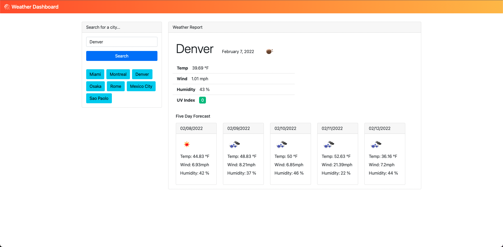
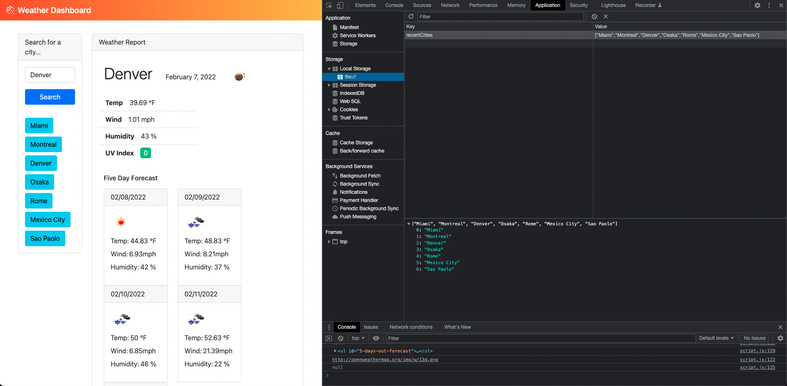

# Weather Dashboard

This is a simple Weather Dashboard application that leverages the Open Weather Map OneCall API to generate the current weather as well as a 5-day forecast for an entered city. Recently searched for cities are also added to a recent cities list so that city can be quickly searched for again. Recent cities are pulled from the browser's localStorage so they will persist on page reload. 

 

## Link to Deployed Application 

https://n-r-martin.github.io/weather-dashboard/

 

## Screengrabs

 

